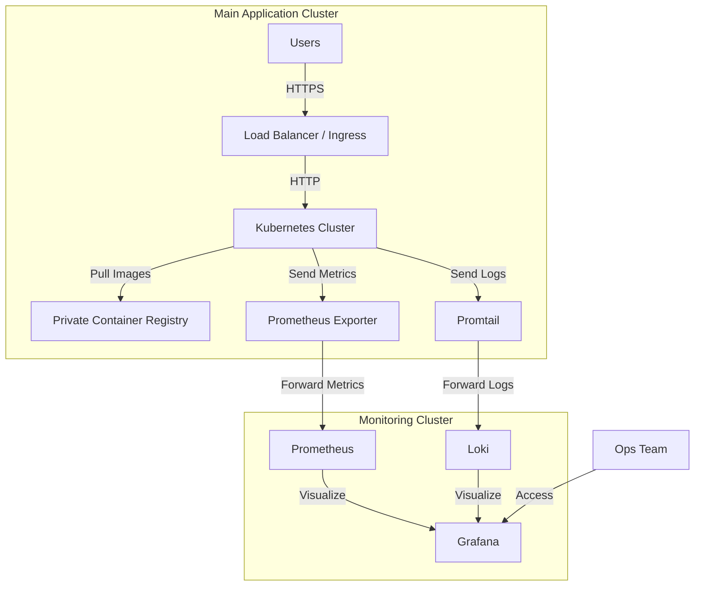
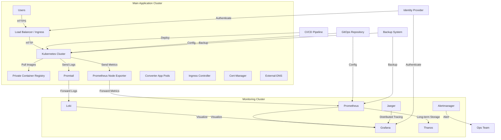

## Task:
create a plan and then implement it using Ansible to make the developped application available to users in a production environment.
Requirements:
- The application has to be accessible to your end-users
- You have to mention what technologies you would use to publish and deploy your application and provision the infrastructure for it
- Create a simple diagram to illustrate your proposed architecture using mirmade. The goal is clarity, not complexity. Ensure a teammate could easily understand it. Use a tool like mirmade to generate a detailed diagram for the architecture.
- Implement redundancy measures (since this is a production environment)
- You can use any technologies you like but prioritize those mentioned in the job advertisement if applicable.

## Solution:
### Description:

This task will be done considering these items:
- generate an Ansible role to deploy the architecture on a linuxed based setup on onprem datacenter
- consider Grafana and Prometheus for monitoring and Grafana Loki stack instead of the ELK stack for logging
- implementation for deploying the application in a production environment using Highly available Kubernetes and Grafana Loki. Here's the updated plan and Ansible role:
- The monitoring will be deployed on another seperate k8s cluster for high availability.

### Plan

1. **Architecture Overview:**
   - Use Kubernetes for container orchestration
   - Implement Ingress Controller for load balancing
   - Use a private container registry (e.g., Harbor) for storing images
   - Implement Prometheus and Grafana for monitoring
   - Use Grafana Loki for log aggregation and analysis

2. **Monitoring Cluster:
   - Set up a separate Kubernetes cluster for monitoring and logging
   - Deploy Prometheus, Grafana, and Loki on this cluster
   - Ensure high availability by using multiple nodes across availability zones


3. **Server Setup:**
   - 3 Kubernetes master nodes for high availability
   - 3+ Kubernetes worker nodes for running application pods
   - 1 Load Balancer node for Ingress Controller
   - 1 Monitoring node for Prometheus, Grafana, and Loki
   - 1 Registry node for private container registry

3. **Network Setup:**
   - Use a private network for inter-node communication
   - Expose only necessary ports to the public network
   - Establish secure network connectivity between the main and monitoring clusters

4. **Security:**
   - Implement network policies in both Kubernetes clusters
   - Use TLS for Kubernetes API server communication
   - Secure the private registry and monitoring tools with authentication

5. **Redundancy:**
   - Multiple Kubernetes master and worker nodes in both clusters
   - Replicated pods in Kubernetes Deployments
   - Regular backups of etcd and other critical data

### Architecture Diagram

Here's a Mermaid diagram illustrating the proposed Kubernetes-based architecture:




#### Deatiled diagram:
This diagram will be a bit comlex so I decided to put it in this section for more clarity:



### Key Components and Considerations

1. **Main Application Cluster:**
   - **Kubernetes Cluster:** Hosts the converter application and related services.
   - **Ingress Controller:** Manages external access to services within the cluster.
   - **Cert-Manager:** Automates the management and issuance of TLS certificates.
   - **External-DNS:** Automates the creation and management of DNS records.
   - **Private Container Registry:** Securely stores and manages container images.

2. **Monitoring Cluster:**
   - **Prometheus:** Collects and stores metrics from both clusters.
   - **Grafana:** Visualizes metrics and logs.
   - **Loki:** Aggregates and indexes logs from all services
   - **Alertmanager:** Handles alerts from Prometheus and other sources
   - **Thanos:** Provides long-term storage for Prometheus metrics.
   - **Jaeger:** Implements distributed tracing for better observability.

3. **Security Considerations:**
   - Implement network policies to control traffic between pods and clusters
   - Use TLS for all inter-cluster and external communications
   - Employ an Identity Provider for authentication and authorization.
   - Regularly update and patch all components.

4. **Scalability and Performance:**
   - Implement horizontal pod autoscaling based on CPU and custom metrics.
   - Use node autoscaling to automatically adjust cluster size.
   - Implement caching mechanisms where appropriate.

5. **High Availability:**
   - Deploy multiple replicas of critical components across different availability zones.
   - Use pod disruption budgets to ensure service availability during updates
   - Implement proper liveness and readiness probes for all services

6. **Backup and Disaster Recovery:**
   - Regularly backup etcd data and persistent volumes.
   - Implement a disaster recovery plan with off-site backups

7. **CI/CD and GitOps:**
   - Use a CI/CD pipeline for automated testing and deployment.
   - Implement GitOps practices for managing cluster configurations

8. **Monitoring and Logging:**
   - Set up comprehensive monitoring with Prometheus and Grafana.
   - Implement centralized logging with Loki.
   - Use distributed tracing with Jaeger for complex request flows.

9. **Cost Optimization:**
   - Implement resource requests and limits for all pods.
   - Use spot instances where appropriate for non-critical workloads.
   - Regularly review and optimize resource usage.

10. **Compliance and Governance:**
    - Implement policies for resource creation and usage.
    - Regularly audit access and changes to the clusters
    - Ensure compliance with relevant industry standards and regulations.

This architecture provides a robust, scalable, and secure environment for deploying the converter application. It addresses key considerations such as high availability, monitoring, security, and scalability while providing flexibility for future growth and changes.


### Ansible Role

Here's an Ansible role to deploy this Kubernetes-based architecture. This part will just describe the Ansible role and the high-level implementation. The yml contents of each role are not part of this architectural solution. The directory structure of the project would like this:


```
complete_converter_deployment/
├── roles/
│   ├── common/
│   ├── kubernetes/
│   ├── app_cluster/
│   ├── monitoring_cluster/
│   ├── security/
│   ├── networking/
│   ├── ci_cd/
│   └── backup/
├── playbooks/
│   ├── main.yml
│   ├── app_cluster.yml
│   └── monitoring_cluster.yml
├── inventory/
│   ├── hosts
│   └── group_vars/
├── ansible.cfg
└── README.md
```

Let's break down each role and its main tasks:

1. `common` role:

```yaml
# roles/common/tasks/main.yml
---
- name: Update and upgrade packages
  apt:
    update_cache: yes
    upgrade: yes
  when: ansible_os_family == "Debian"

- name: Install common packages
  apt:
    name:
      - curl
      - apt-transport-https
      - ca-certificates
      - software-properties-common
    state: present
  when: ansible_os_family == "Debian"

- name: Set up timezone
  timezone:
    name: UTC
```

2. `kubernetes` role:

```yaml
# roles/kubernetes/tasks/main.yml
---
- name: Add Kubernetes apt key
  apt_key:
    url: https://packages.cloud.google.com/apt/doc/apt-key.gpg
    state: present

- name: Add Kubernetes repository
  apt_repository:
    repo: deb https://apt.kubernetes.io/ kubernetes-xenial main
    state: present

- name: Install Kubernetes packages
  apt:
    name:
      - kubelet
      - kubeadm
      - kubectl
    state: present

- name: Initialize Kubernetes cluster
  command: kubeadm init --pod-network-cidr=10.244.0.0/16
  when: inventory_hostname in groups['master_nodes']

- name: Install Calico network plugin
  command: kubectl apply -f https://docs.projectcalico.org/manifests/calico.yaml
  when: inventory_hostname == groups['master_nodes'][0]
```

3. `app_cluster` role:

```yaml
# roles/app_cluster/tasks/main.yml
---
- name: Deploy Ingress Controller
  kubernetes:
    definition: "{{ lookup('template', 'ingress-controller.yml.j2') }}"
  when: inventory_hostname == groups['master_nodes'][0]

- name: Deploy Cert-Manager
  kubernetes:
    definition: "{{ lookup('template', 'cert-manager.yml.j2') }}"
  when: inventory_hostname == groups['master_nodes'][0]

- name: Deploy External-DNS
  kubernetes:
    definition: "{{ lookup('template', 'external-dns.yml.j2') }}"
  when: inventory_hostname == groups['master_nodes'][0]

- name: Deploy Converter Application
  kubernetes:
    definition: "{{ lookup('template', 'converter-app.yml.j2') }}"
  when: inventory_hostname == groups['master_nodes'][0]

- name: Deploy Promtail
  kubernetes:
    definition: "{{ lookup('template', 'promtail.yml.j2') }}"
  when: inventory_hostname == groups['master_nodes'][0]
```

4. `monitoring_cluster` role:

```yaml
# roles/monitoring_cluster/tasks/main.yml
---
- name: Deploy Prometheus
  kubernetes:
    definition: "{{ lookup('template', 'prometheus.yml.j2') }}"
  when: inventory_hostname == groups['monitoring_master_nodes'][0]

- name: Deploy Grafana
  kubernetes:
    definition: "{{ lookup('template', 'grafana.yml.j2') }}"
  when: inventory_hostname == groups['monitoring_master_nodes'][0]

- name: Deploy Loki
  kubernetes:
    definition: "{{ lookup('template', 'loki.yml.j2') }}"
  when: inventory_hostname == groups['monitoring_master_nodes'][0]

- name: Deploy Alertmanager
  kubernetes:
    definition: "{{ lookup('template', 'alertmanager.yml.j2') }}"
  when: inventory_hostname == groups['monitoring_master_nodes'][0]

- name: Deploy Thanos
  kubernetes:
    definition: "{{ lookup('template', 'thanos.yml.j2') }}"
  when: inventory_hostname == groups['monitoring_master_nodes'][0]

- name: Deploy Jaeger
  kubernetes:
    definition: "{{ lookup('template', 'jaeger.yml.j2') }}"
  when: inventory_hostname == groups['monitoring_master_nodes'][0]
```

5. `security` role:

```yaml
# roles/security/tasks/main.yml
---
- name: Apply network policies
  kubernetes:
    definition: "{{ lookup('template', 'network-policies.yml.j2') }}"
  when: inventory_hostname in groups['master_nodes'] + groups['monitoring_master_nodes']

- name: Set up TLS certificates
  command: kubectl apply -f https://github.com/jetstack/cert-manager/releases/download/v1.5.3/cert-manager.yaml
  when: inventory_hostname == groups['master_nodes'][0]

- name: Configure RBAC
  kubernetes:
    definition: "{{ lookup('template', 'rbac.yml.j2') }}"
  when: inventory_hostname in groups['master_nodes'] + groups['monitoring_master_nodes']
```

6. `networking` role:

```yaml
# roles/networking/tasks/main.yml
---
- name: Set up VPN between clusters
  openvpn:
    name: inter_cluster_vpn
    server: "{{ hostvars[groups['master_nodes'][0]]['ansible_host'] }}"
    remote_host: "{{ hostvars[groups['monitoring_master_nodes'][0]]['ansible_host'] }}"

- name: Configure firewall rules
  ufw:
    rule: allow
    port: "{{ item }}"
  loop:
    - "6443"  # Kubernetes API
    - "10250"  # Kubelet
    - "2379"   # etcd
    - "2380"   # etcd peer
```

7. `ci_cd` role:

```yaml
# roles/ci_cd/tasks/main.yml
---
- name: Install GitLab Runner
  apt:
    name: gitlab-runner
    state: present

- name: Configure GitLab Runner
  template:
    src: gitlab-runner-config.toml.j2
    dest: /etc/gitlab-runner/config.toml

- name: Set up ArgoCD
  kubernetes:
    definition: "{{ lookup('template', 'argocd.yml.j2') }}"
  when: inventory_hostname == groups['master_nodes'][0]
```

8. `backup` role:

```yaml
# roles/backup/tasks/main.yml
---
- name: Install Velero
  kubernetes:
    definition: "{{ lookup('template', 'velero.yml.j2') }}"
  when: inventory_hostname in groups['master_nodes'] + groups['monitoring_master_nodes']

- name: Configure backup schedule
  kubernetes:
    definition: "{{ lookup('template', 'backup-schedule.yml.j2') }}"
  when: inventory_hostname == groups['master_nodes'][0]

- name: Set up off-site backup
  aws_s3:
    bucket: your-backup-bucket
    mode: create
  when: inventory_hostname == groups['master_nodes'][0]
```

Now, let's create the main playbook that ties everything together:

```yaml
# playbooks/main.yml
---
- name: Set up common configuration
  hosts: all
  roles:
    - common

- name: Deploy Application Cluster
  hosts: app_cluster
  roles:
    - kubernetes
    - app_cluster
    - security
    - networking
    - ci_cd
    - backup

- name: Deploy Monitoring Cluster
  hosts: monitoring_cluster
  roles:
    - kubernetes
    - monitoring_cluster
    - security
    - networking
    - backup

- name: Final Configuration
  hosts: all
  tasks:
    - name: Ensure all services are running
      command: kubectl get pods --all-namespaces
      register: pod_status
      until: "'Running' in pod_status.stdout"
      retries: 10
      delay: 30
      when: inventory_hostname in groups['master_nodes'] + groups['monitoring_master_nodes']
```

This comprehensive Ansible setup covers all aspects of the architecture we designed, including:

1. Setting up Kubernetes clusters for both application and monitoring
2. Deploying the converter application with necessary supporting services
3. Implementing a robust monitoring and logging stack
4. Ensuring security through network policies, RBAC, and TLS
5. Establishing networking between clusters
6. Setting up CI/CD pipelines
7. Implementing backup and disaster recovery solutions

To use this Ansible configuration:

1. Ensure your inventory file (`inventory/hosts`) is properly set up with your server IPs.
2. Customize the variables in `inventory/group_vars/` for your specific environment.
3. Review and adjust the templates in each role's `templates/` directory as needed.
4. Run the main playbook with: `ansible-playbook -i inventory/hosts playbooks/main.yml`

This setup provides a scalable, secure, and maintainable way to deploy and manage our converter application in a production environment, following best practices for Kubernetes deployments and incorporating comprehensive monitoring and logging solutions.

#### Notes:
The main advantages of using Grafana Loki over the ELK stack in this setup are:

1. **Resource Efficiency**: Loki is designed to be lightweight and consume fewer resources compared to Elasticsearch.

2. **Integration with Grafana**: Loki seamlessly integrates with Grafana, allowing you to query your logs and correlate your metrics with logs in a familiar environment.

3. **Simplified Architecture**: Loki follows a more streamlined approach, making it easier to set up and maintain compared to the ELK stack.

4. **Cost-Effective**: Due to its efficient indexing strategy, Loki can be more cost-effective for log storage and querying.

5. **Prometheus-Inspired**: If you're already using Prometheus for metrics, Loki's query language (LogQL) will feel familiar, as it's inspired by PromQL.

The IP addresses, ports, and other variables are my assumptions and we need to change them according to your specific environment.